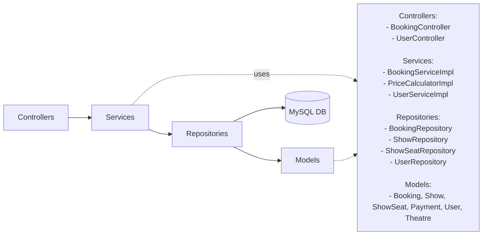

# Book My Show

`BookMyShowJuly14` is a Spring Boot Java project that models a simplified movie-ticket booking backend. It contains domain entities (Show, Theatre, ShowSeat, Booking, Payment, User, etc.), Spring Data JPA repositories, services that implement booking logic, and controller classes. The code focuses on correct booking semantics, transaction isolation, and domain modeling rather than providing an HTTP API surface.

---

## Quick facts

* Java + Spring Boot project (Maven).
* Main class: `com.scaler.bookmyshowjuly14.BookMyShowJuly14Application`.
* DB used in configuration: MySQL (see `target/classes/application.properties`).
* Transactional booking implementation: `com.scaler.bookmyshowjuly14.services.BookingServiceImpl` annotated with `@Transactional(isolation = Isolation.SERIALIZABLE)`.
* Layers: `models/`, `repositories/`, `services/`, `controllers/`, `dtos/`.
* There are controller classes (`BookingController`, `UserController`) but they are plain Spring `@Controller` classes whose methods are *not* annotated with `@RequestMapping` / `@GetMapping` / `@PostMapping`. That means the project as-is does NOT expose REST HTTP endpoints.

---

## Build & run (exact)

From the project root (where `mvnw` and `pom.xml` are located):

### Requirements

* Java 11+ (or compatible JDK used for the project).
* Maven (mvn) is optional, the `mvnw` wrapper is optional.

### Run locally (dev)

1. Ensure MySQL is running and accessible or change JDBC config in `src/main/resources/application.properties` (or the `target/classes/application.properties` copied into the zip). The repo contains:

```
spring.datasource.url=jdbc:mysql://localhost:3306/bookmyshowjuly14
spring.datasource.username=bookmyshowjuly14_user
#spring.datasource.password=secret
spring.datasource.driver-class-name=com.mysql.cj.jdbc.Driver
spring.jpa.hibernate.ddl-auto=update
spring.jpa.show-sql=true
```

2. To build & run:

```bash
# on Unix
./mvnw clean package
./mvnw spring-boot:run

# OR run the packaged JAR:
java -jar target/BookMyShowJuly14-<version>.jar
```

3. The application starts as a Spring Boot app. Because controllers do not expose request mappings (see "What’s missing" below), there is no HTTP API to call by default. The app still boots and wiring of beans/services will run.

---

## Project layout (important files & packages)

```
src/main/java/com/scaler/bookmyshowjuly14/
├─ BookMyShowJuly14Application.java      # Spring Boot main
├─ controllers/
│  ├─ BookingController.java             # a Spring @Controller (methods are not mapped)
│  └─ UserController.java
├─ dtos/                                 # DTO classes used by controllers/services
├─ models/                               # JPA entities: Booking, Show, Theatre, User, Payment, ShowSeat, ...
├─ repositories/                         # Spring Data JPA repos
├─ services/                             # Business logic, BookingServiceImpl, PriceCalculatorImpl, etc.
└─ ...
```

---

## Architecture diagram (Mermaid)

This diagram reflects the code structure and runtime interactions in this repository (service & repository layers).



---

## What the code actually does (concise)

* **Domain modeling**: Entities for shows, theatres, seats, bookings, payments, users and enums for statuses (e.g., `BookingStatus`, `PaymentStatus`, `ShowSeatStatus`).
* **Persistence layer**: `Spring Data JPA` repositories for each entity (`ShowRepository`, `ShowSeatRepository`, `BookingRepository`, `UserRepository`, ...).
* **Booking logic**: Implemented in `BookingServiceImpl` with `@Transactional(isolation = Isolation.SERIALIZABLE)`. The service constructs `Booking` objects, calculates prices via `PriceCalculator`, sets booking status to `PENDING`, and persists bookings using repositories.
* **Price calculation**: `PriceCalculator` interface and `PriceCalculatorImpl` concrete implementation used by the booking flow.
* **Controllers**: There are controller classes, DTOs and response objects, but controller methods are not mapped to HTTP endpoints. They currently act as regular beans/wrappers rather than a REST API.

---

## Design tradeoffs & problems solved (real, code-level)

### 1) Correctness under concurrency

* **What the project does**: `BookingServiceImpl` is annotated at the class level with `@Transactional(isolation = Isolation.SERIALIZABLE)`. Using SERIALIZABLE isolation is a direct, conservative strategy to avoid anomalies like phantom reads and lost updates while booking seats. It keeps booking writes safe under concurrent transactions.
* **Tradeoff**: SERIALIZABLE is the strongest isolation and it simplifies reasoning about correctness, but it reduces concurrency and throughput under load; it will likely lead to more DB lock contention and reduced scalability when many users try to book seats simultaneously.

### 2) Domain-driven separation

* **What the project does**: Clear layers (entities, repositories, services, DTOs). Price calculation is separated into its own component.
* **Tradeoff**: This separation improves testability and code clarity. However, there is no inter-service messaging, no caching, and no external payment integration scaffolding. You get correct, easy-to-follow transactional logic, but not the scalability features you’d add to a production system (caching, seat-hold TTLs, async finalisation).

### 3) Simplicity vs production readiness

* **What the project does**: Uses Spring Data JPA and immediate persistence for bookings (PENDING status), which makes the implementation straightforward.
* **Tradeoff**: Simplicity makes it easier to reason about correctness, but real ticketing systems often use a multi-step flow: short-term seat hold (in-memory/Redis) + payment + final DB commit. This repo chooses the simpler model (persist PENDING bookings) with strong DB isolation rather than distributed short-term holds.

### 4) Payment modeling

* **What the project does**: Payment entities and `PaymentGateway` enum exist, but there is no integration with real gateways. Payment/status are tracked on `Payment` entities.
* **Tradeoff**: The code models payments so it’s straightforward to plug a gateway later; however, lack of webhook handling, idempotency strategies and external integration are missing currently.

## Useful code pointers (where to look)

* Main application: `src/main/java/com/scaler/bookmyshowjuly14/BookMyShowJuly14Application.java`
* Entities: `src/main/java/com/scaler/bookmyshowjuly14/models/`
* Booking logic: `src/main/java/com/scaler/bookmyshowjuly14/services/BookingServiceImpl.java` (contains `@Transactional(isolation = Isolation.SERIALIZABLE)`)
* Repositories: `src/main/java/com/scaler/bookmyshowjuly14/repositories/`
* Controllers: `src/main/java/com/scaler/bookmyshowjuly14/controllers/` (currently not mapped as HTTP endpoints)
* App properties (packaged): `target/classes/application.properties`
